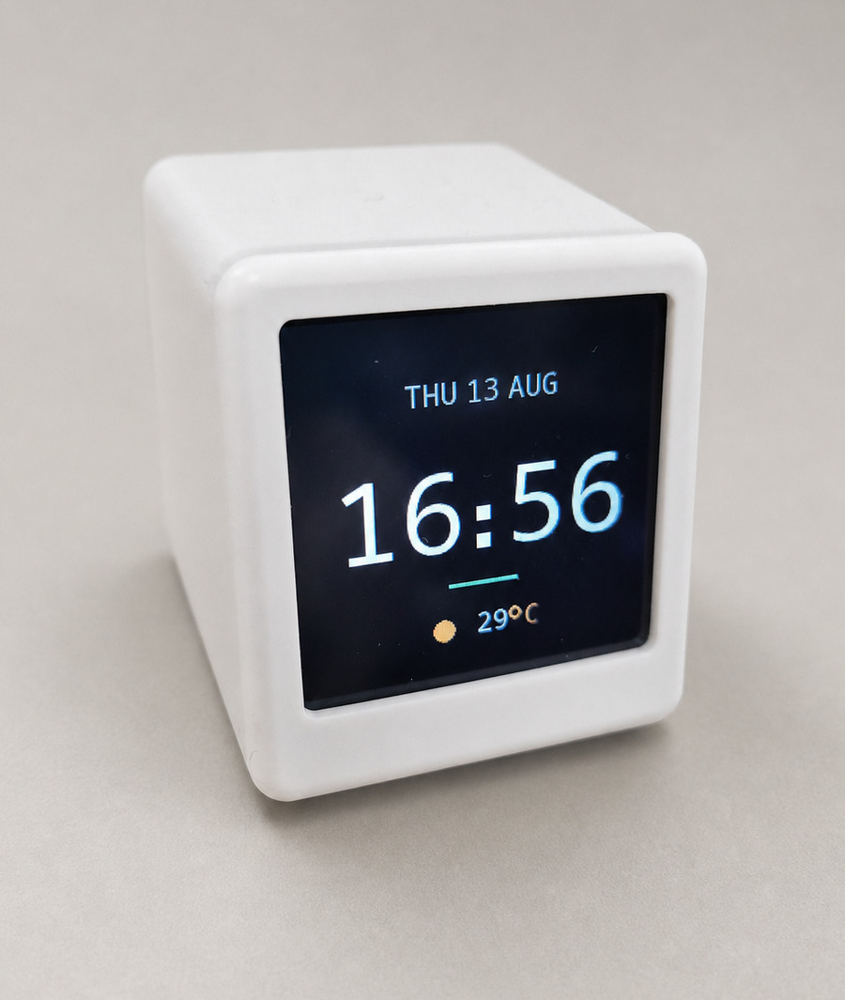
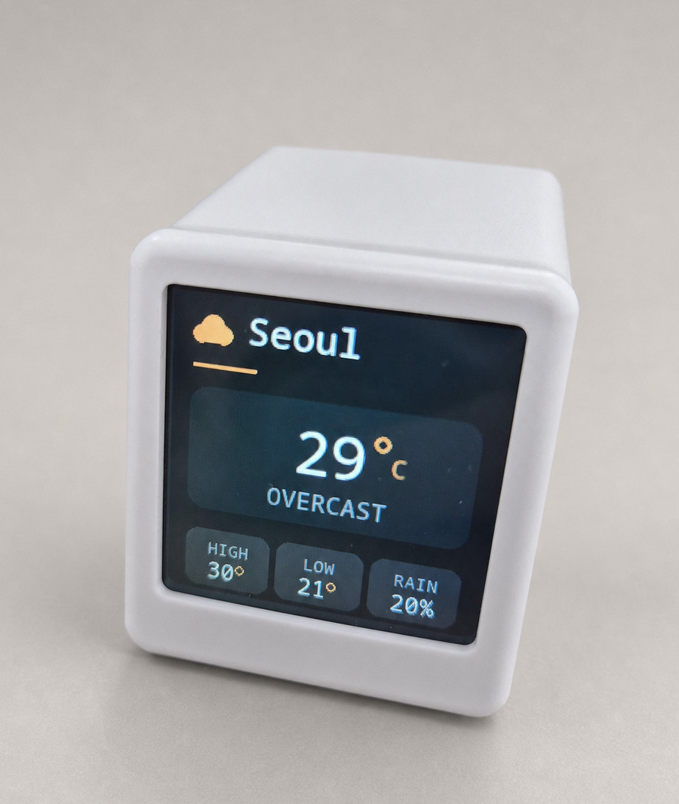
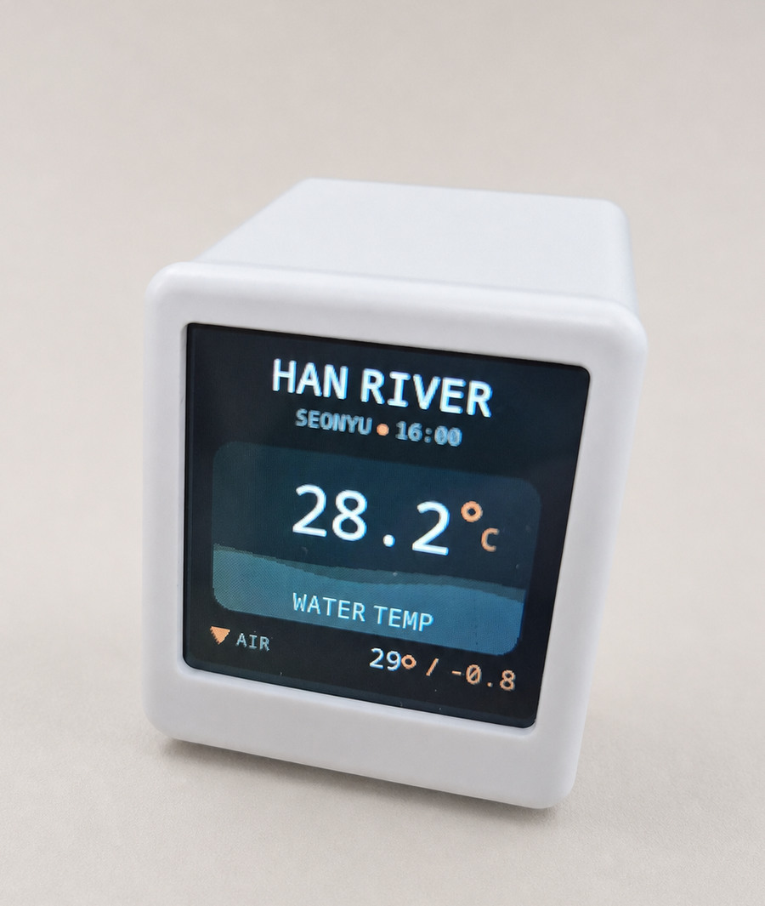
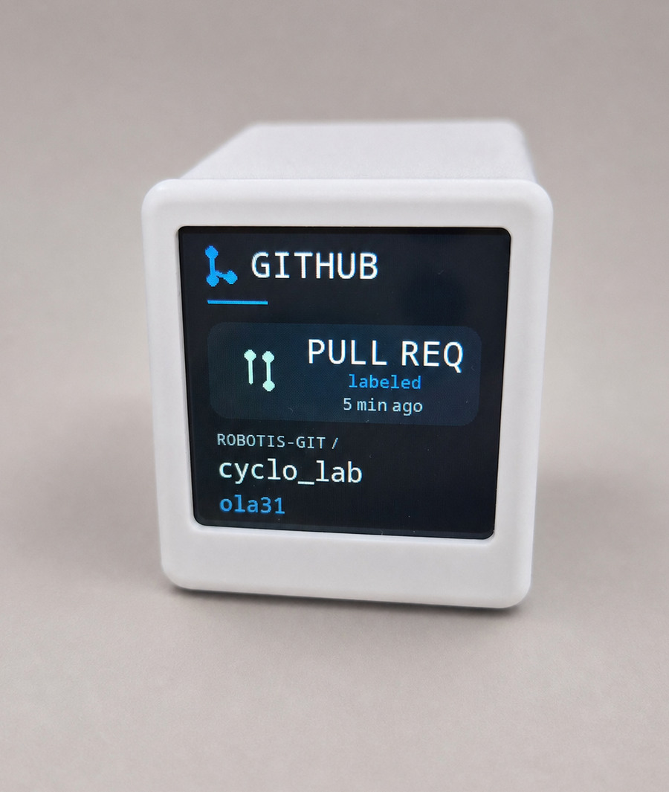

# GeekMagic SmallTV ESP8266 Firmware

Custom ESP8266 firmware for GeekMagic SmallTV-style smart weather clocks with a 240x240 ST7789 display. The firmware provides an authenticated web dashboard, WiFi setup, OTA updates, feed integrations, image display, and selected GeekMagic-style compatibility endpoints.

The project has been tested on the GeekMagic SmallTV Ultra ESP8266 variant. Other ESP8266-based variants may require pin or build-flag changes. The ESP32-based SmallTV Pro is not a target for this repository.

<p align="center">
  
  
  
  
</p>

<p align="center"><sub>Time · Weather · Han River · GitHub</sub></p>

## For Humans

Strongly recommended: **let an LLM agent install this for you.** Getting this
firmware onto the device involves a flash-mode gotcha, a two-hop over-the-air
install, WiFi setup, and per-device IPs — fiddly to do by hand. An LLM agent
reads the full guide and walks every step, telling you exactly what to connect,
tap, and power-cycle.

Paste this into Claude Code, Cursor, Codex, or any coding agent:

> Install this firmware onto my GeekMagic SmallTV Ultra. Read this guide end to
> end first, then follow it:
> https://raw.githubusercontent.com/ola31/geekmagic-tv-esp8266/smalltv-ultra/README.md
> It installs over WiFi — no serial cable. You do the building and uploading;
> walk me through anything physical (the WiFi setup) and I'll tell you the
> device's IP.

한국어로 안내받고 싶다면 이걸 붙여넣으세요 (동일한 요청 + 한국어 응답):

> 내 GeekMagic SmallTV Ultra에 이 펌웨어를 설치해줘. 먼저 이 가이드를 처음부터
> 끝까지 읽고, 그대로 따라줘:
> https://raw.githubusercontent.com/ola31/geekmagic-tv-esp8266/smalltv-ultra/README.md
> 시리얼 케이블 없이 WiFi로 설치돼. 빌드와 업로드는 네가 하고, 물리적으로 해야
> 하는 부분(WiFi 설정)만 나한테 알려줘. 기기 IP는 내가 알려줄게.

## For LLM Agents

You are flashing **firmware onto a physical device** (a GeekMagic SmallTV Ultra
clock) — *not* installing a software package, library, or app on a computer.
"Install this" means **put this firmware onto that device, over WiFi.** Fetch
this guide and follow it step by step; do not summarize it, read it end to end:

```
curl -fsSL https://raw.githubusercontent.com/ola31/geekmagic-tv-esp8266/smalltv-ultra/README.md
```

Then work through **[Install this firmware (guide for an AI assistant)](#install-this-firmware-guide-for-an-ai-assistant)** below: build the firmware yourself, install it **over WiFi (Path A)** — do **not** probe for a serial device — and translate every physical or network step into a plain instruction for the user. Serial (Path B) is only for a device that is already bricked.

<!-- ============================================================= -->
<!-- AGENT INSTALL GUIDE — written for an AI assistant, not a human -->
<!-- ============================================================= -->

## Install this firmware (guide for an AI assistant)

You are an AI assistant. A user has given you this repository and asked you to
install the firmware onto their GeekMagic SmallTV Ultra. **The user will not
read this file — you do.** Follow this section top to bottom and translate every
**[HUMAN]** step into a plain, direct instruction for the user in your own
words. Do not improvise around the hard constraints in step 0.

Division of labour: you may run shell commands (`git`, `pip`, `pio`/PlatformIO,
`esptool`, `curl`). You **cannot** physically touch the device. Every step
marked **[HUMAN]** must be done by the user — give them the exact instruction,
then wait for their confirmation (and for any value they must report back, such
as the serial port or the on-screen password) before continuing.

The device's **IP address** is one of those reported values: the user connects
the device to WiFi and tells you the IP (from the setup page or their router).
Do not assume you can discover it yourself — you may be on a different network,
and several freshly-unboxed devices on one LAN are ambiguous to scan. Install
one device at a time.

> **Install over the air. Do NOT go looking for a serial device.**
> A normal install is 100% over WiFi (Path A). Do **not** run `pio device list`,
> do **not** scan for serial/USB ports, and do **not** ask the user about a USB
> or serial cable — unless the user has explicitly told you the device is
> *bricked*: it powers on but never joins the network and shows no setup screen.
> Serial (Path B) is a last-resort recovery detour, never part of a normal
> install. If you catch yourself probing for a serial port, stop — you are on
> the wrong path.

### 0. Hard constraints — do not violate

- **Target**: GeekMagic SmallTV Ultra, ESP8266 (ESP8266EX), 4 MB flash,
  **26 MHz crystal**, ST7789 240×240 LCD. Not the ESP32 SmallTV Pro.
- **Flash mode must be DOUT.** A DIO image boots while warm but crash-loops
  after a cold power cycle and falls off the network. This repo already builds
  DOUT (`board_build.flash_mode = dout`); never override it, and always pass
  `--flash-mode dout` to esptool.
- **Use esptool ≥ 5.** The 26 MHz crystal makes esptool 3.x fail to sync
  ("No serial data received" / "Timed out"). Version 5 handles it.
- **Prefer over-the-air; serial is only a recovery fallback.** A device that
  runs the GeekMagic stock firmware (or any working OTA-capable firmware) can be
  installed entirely over WiFi via the two-hop bootstrap below (Path A). Use
  serial (Path B) only for a blank or bricked device that cannot run any updater.
- **The full firmware is too big for the stock OTA staging** (~900 KB vs the
  ~520 KB the stock image leaves), so Path A installs a small bootstrap first,
  then the full firmware through the bootstrap.
- **Source branch is `smalltv-ultra`.** If you cloned and the code does not
  match this README, check that branch out.

### 1. Get the code — [AGENT]

```bash
git clone <this-repo-url> smalltv-ultra && cd smalltv-ultra
git checkout smalltv-ultra   # skip if it is already the default branch
```

### 2. Install the toolchain — [AGENT]

```bash
pip install -U platformio "esptool>=5"
```

### 3. Build both firmwares — [AGENT]

```bash
pio run                       # full firmware -> .pio/build/nodemcuv2/firmware.bin
( cd bootstrap && pio run )   # bootstrap     -> bootstrap/.pio/build/nodemcuv2/firmware.bin
# Confirm DOUT on the full firmware: first 4 bytes must be e9 02 03 40 (byte[2]=03).
xxd -l4 .pio/build/nodemcuv2/firmware.bin   # -> e902 0340
```

If `byte[2]` is `02`, the build is DIO — stop and fix `platformio.ini`
(`board_build.flash_mode = dout`) before flashing. Then pick Path A (over the
air) or, only for a blank/bricked device, Path B (serial).

## Path A — over the air (no serial, recommended)

Use this when the device already runs the GeekMagic stock firmware (or any
firmware with a working updater). It takes two hops, both over WiFi. The stock
image reserves a **3 MB filesystem**, which both caps the OTA staging at ~520 KB
and leaves no room for the ~900 KB app. The bootstrap solves both problems: it
is small enough to go through the stock updater, and it re-declares a **1 MB
filesystem**, reclaiming ~2 MB of flash so the full firmware then fits.

> Note: this is how the maintainer installed the firmware — entirely over the
> air, with no serial cable. Serial (Path B) is only for a device that is
> already blank or bricked and cannot run any updater. (Updating a device that
> already runs *this* firmware is an even simpler one-step OTA; see "Updating
> later" below.)

### A1. Connect the new device to WiFi and get its IP — [HUMAN]

A factory-fresh GeekMagic device opens its own WiFi access point (named
**`GIFTV`** on the stock firmware). Have the user:

1. Join the `GIFTV` network and open `http://192.168.4.1`.
2. Select their home WiFi and enter the password.
3. After it connects, the device **shows its IP on its own screen** — have the
   user read it from the display and report it. (If the screen is unclear, the
   router's client list is a fallback.) Do several devices one at a time so each
   IP is unambiguous.

### A2. Upload the bootstrap through the stock updater — [HUMAN]

Tell the user to open the stock firmware's web interface at the device IP and
use its firmware-update to upload `bootstrap/.pio/build/nodemcuv2/firmware.bin`
(~394 KB — small enough for the stock staging; give them the file's full path).
The exact menu depends on the stock firmware version.

### A3. Point the bootstrap at WiFi and get its IP — [HUMAN]

After it reboots, the bootstrap shows a `BOOTSTRAP` screen. It usually reconnects
to the WiFi from A1 automatically; if it cannot, it opens an open AP named
**`SmallTV-Setup`** — have the user join it, open `http://192.168.4.1`, and
reselect their WiFi. Either way the screen shows `READY` with an IP; report it.

### A4. Upload the full firmware to the bootstrap — [AGENT]

```bash
FW=.pio/build/nodemcuv2/firmware.bin
curl -F "firmware=@$FW;filename=firmware.bin" \
  "http://<bootstrap-ip>/update?size=$(stat -c%s "$FW")&md5=$(md5sum "$FW" | cut -d' ' -f1)"
# The bootstrap verifies size + md5 and reboots into the full firmware.
```

Then continue at **Join WiFi** below.

## Path B — serial (blank or bricked device only)

**Do not run anything in this section during a normal install.** Use it only
when the device is confirmed *bricked or blank* — it powers on but never joins
the network and shows no setup screen — so it cannot run any updater. If the
device reaches WiFi or a setup page at all, you are on Path A, not here.
Requires a 3.3 V USB-to-UART adapter.

### B1. Connect the adapter and enter download mode — [HUMAN]

Tell the user to:

1. Wire a **3.3 V** USB-to-UART adapter to the device's UART header:
   adapter **TX → device RX**, adapter **RX → device TX**, **GND → GND**.
   (Do not feed 5 V logic to the ESP8266.)
2. Plug the adapter into the machine where you (the agent) run commands.
3. Put the board in **download/flash mode**: hold **GPIO0 (BOOT) to GND**, then
   power the device on (or press reset) while holding it, then release.
   Adapters without auto-reset (DTR/RTS unwired) require this manual step.

### B2. Flash the firmware — [AGENT]

Find the port yourself, then flash — no separate connection check is needed, as
`write-flash` connects first and fails clearly if the board is not ready:

```bash
pio device list      # find the adapter's port; or ls /dev/ttyUSB* (Linux) / /dev/cu.usb* (macOS)
PORT=<port from above>
esptool --port "$PORT" --baud 115200 --before no-reset --after no-reset \
  write-flash --flash-mode dout --flash-freq 40m --flash-size 4MB \
  0x0 .pio/build/nodemcuv2/firmware.bin
```

Wait for `Hash of data verified.` If esptool reports "No serial data received",
the board is not in download mode — have the user redo B1 (hold GPIO0 to GND,
then power-cycle) and run this again. `firmware.bin` at `0x0` carries the
bootloader and the app; the filesystem and WiFi region are preserved.

### B3. Boot it — [HUMAN]

Tell the user to remove the GPIO0-to-GND connection, power-cycle the device,
and leave it powered on.

## After install: WiFi and admin password — [HUMAN, then AGENT]

**Path A**: the full firmware reuses the WiFi already configured in A1/A3, so it
reconnects automatically after A4 — no new setup AP appears. Ask the user to
read the admin password from the device screen and report the device IP (it may
change, so confirm it rather than reusing the bootstrap's).

**Path B**: the freshly flashed device has no saved WiFi, so it opens an **open**
access point named **`SmartClock-Setup`**. Have the user join it, open
`http://192.168.4.1`, pick their WiFi and enter the password; the device then
joins and shows its IP.

In both cases: the admin user is `admin` and the password is **4 digits**, shown
on the device screen on first boot. If it was missed, open the device IP in a
browser and click **"Show password on device"** on the login popup — it
re-displays the password on the screen for 15 seconds. Report the device IP (and
the admin password if you will run OTA updates).

## Verify install — [AGENT]

```bash
curl -m 8 http://<device-ip>/auth/status   # JSON with deviceName -> success
```

The device is installed. It rotates through clock, weather, Han River water
temperature, and GitHub event pages.

### Updating later, over the air — [AGENT]

Once the device runs this firmware, update it without serial:

```bash
pio run
FW=.pio/build/nodemcuv2/firmware.bin
curl -c cookies.txt -X POST http://<ip>/auth/login \
  -H 'Content-Type: application/json' \
  -d '{"username":"admin","password":"<admin-password>"}'
curl -b cookies.txt -F "firmware=@$FW;filename=firmware.bin" \
  "http://<ip>/update?size=$(stat -c%s "$FW")&md5=$(md5sum "$FW" | cut -d' ' -f1)"
# The device verifies the md5 and reboots. Re-login afterwards (sessions reset on reboot).
```

### If something goes wrong — [tell the HUMAN]

- **Bad update or misconfiguration**: power-cycle 3 times quickly → the device
  enters recovery mode with the web UI and OTA still reachable; re-flash over OTA.
- **Reset everything (WiFi kept)**: power-cycle 10 times quickly → factory reset.
- **Device won't boot / not on the network at all**: reflash over serial
  (Path B). This is the only failure serial recovers that OTA cannot.

<!-- ============================================================= -->
<!-- End of agent guide. Human reference follows.                  -->
<!-- ============================================================= -->

## Features

- Authenticated web dashboard for display, feed, network, OTA, and system management
- ST7789 240x240 display support through TFT_eSPI
- Captive portal WiFi setup with randomized setup AP password
- mDNS discovery using the configured device hostname
- ArduinoOTA and web OTA using the current admin password
- LittleFS persistence for dashboard, feed, and authentication configuration
- EEPROM settings validation with firmware version and CRC checks
- NTP time synchronization with configurable UTC offset
- Day and night display profiles with scheduled brightness and theme options
- Rotating display pages: clock, weather, Han River water temperature, and GitHub events
- Live feeds: Open-Meteo weather (Seoul by default), Han River water temperature, and GitHub events
- Monospace UI with anti-aliased clock and temperature numerals
- Temporary JPEG upload and rendering
- Recovery boot mode by three quick power cycles, or factory reset by ten quick power cycles

## Hardware

Target hardware:

- ESP8266 NodeMCU v2-compatible board
- ST7789 240x240 TFT display
- 4 MB flash recommended

Display and button pin mapping:

| Function | ESP8266 GPIO |
|----------|--------------|
| MOSI | GPIO13 |
| SCLK | GPIO14 |
| DC | GPIO0 |
| RST | GPIO2 |
| Backlight PWM | GPIO5 |
| Button | GPIO4 |

The active build flags are defined in `platformio.ini`.

The button on GPIO4 cycles to the next display page with a short press and toggles the backlight with a long press.

## Important Notes

A device already running the GeekMagic stock firmware can be installed entirely over the air (see Path A in the agent guide above): upload the small `bootstrap` image through the stock firmware's updater, then upload the full firmware to the bootstrap. Serial flashing is only needed for a blank or bricked device.

Uploaded images are temporary. The firmware clears `/image/` on boot and resets stale image state.

The device uses flash-backed storage. Avoid automations that write settings or upload images at high frequency.

## Build Requirements

- Python 3.7 or newer
- PlatformIO Core or PlatformIO IDE
- USB access to the device for first installation

Install PlatformIO Core:

```bash
pip install platformio
```

Build the firmware:

```bash
pio run
```

The firmware binary is generated at:

```text
.pio/build/nodemcuv2/firmware.bin
```

Useful development commands:

```bash
pio run
pio run -t clean
pio run -t upload
pio device monitor
pio run -t size
```

The serial monitor runs at `115200` baud.

## First-Time Flashing

The preferred first-time install is over the air (Path A in the agent guide
above), which needs no cable. Serial flashing (Path B) is for a blank or bricked
device. Any serial method must write a **DOUT** image: this repo's `firmware.bin`
is already DOUT, and `pio run -t upload` honours the `board_build.flash_mode`
setting — a DIO image boots warm but crash-loops after a cold power cycle.

One convenient serial option is the [Spacehuhn ESP web flasher](https://esptool.spacehuhn.com/). On the tested device, no manual pin wiring is required.

1. Build the firmware with `pio run`, or download a release binary if one is available.
2. Connect the device to the computer with its normal USB cable.
3. Open `https://esptool.spacehuhn.com/` in a browser with Web Serial support, such as Chrome or Edge.
4. Click `Connect`.
5. Select the device serial port.
6. Select `.pio/build/nodemcuv2/firmware.bin`.
7. Start the flash process and wait for it to complete.

The web flasher handles entering flashing mode and restarting the device on boards with working USB serial auto-reset.

PlatformIO can also erase and flash over serial:

```bash
pio run -t erase
pio run -t upload
```

Specify a serial port if needed:

```bash
pio run -t upload --upload-port /dev/ttyUSB0
pio run -t upload --upload-port /dev/cu.usbserial-0001
pio run -t upload --upload-port COM3
```

Alternative esptool flow:

```bash
pip install esptool
esptool.py --port /dev/ttyUSB0 erase_flash
esptool.py --port /dev/ttyUSB0 write_flash 0x0 .pio/build/nodemcuv2/firmware.bin
```

If the web flasher cannot put the device into flashing mode automatically, use the manual bootloader pins as a fallback. Set any USB-to-TTL adapter to 3.3 V logic, cross TX and RX, connect GND, and hold GPIO0 to GND while powering the device.

| USB-to-TTL adapter | Board connector | Notes |
|--------------------|-----------------|-------|
| TX | RX | Crossed UART connection |
| RX | TX | Crossed UART connection |
| GND | GND | Shared ground |

| Board connector | Board connector | Purpose |
|-----------------|-----------------|---------|
| GPIO0 | GND | Enter flash mode |

Do not connect an adapter VCC pin to the board. Do not use 5 V logic.

The GeekMagic board UART connector is shown here:


After manual bootloader flashing, disconnect power, remove the GPIO0-to-GND jumper, and power the device normally.

## First Boot

If no WiFi credentials are stored, the device starts an access point named `SmartClock-Setup`.

Setup flow:

1. Read the setup AP password from the display or serial console.
2. Connect to `SmartClock-Setup`.
3. Open `http://192.168.4.1`.
4. Sign in as `admin` with the generated 10-digit admin password shown on the display or serial console.
5. Configure WiFi from the dashboard.
6. After the device reboots, open the configured hostname or assigned IP address.
7. Change the generated admin password from the dashboard.

The setup AP password and dashboard admin password are separate credentials. The AP password is an 8-digit random numeric password generated for AP mode. The admin password is a 10-digit random numeric password generated when `/auth.json` is missing.

## Hostname and Discovery

The default device name is generated from the chip ID, for example `SmartClock-1A2B3C`. The mDNS hostname is derived from the device name and usually follows this form:

```text
smartclock-1a2b3c.local
```

If the configured device name sanitizes to `smartclock`, the firmware appends the chip ID to avoid a generic hostname. mDNS starts only after WiFi is connected and enough heap is available.

The HTTP service advertises:

| Field | Value |
|-------|-------|
| Service | `_http._tcp` |
| Port | `80` |
| TXT `model` | `SmartClock` |
| TXT `vendor` | `Custom` |
| TXT `api` | `geekmagic` |
| TXT `name` | Configured device name |

## Dashboard

Open the device in a browser:

```text
http://<device-hostname>.local/
http://<device-ip>/
```

The root page loads without a session, but management actions require login.

Dashboard areas:

- Display: clock format, brightness, device name, UTC offset, themes, page rotation, header IP, and night mode
- Feeds: weather, Han River, and GitHub sources, credentials, and manual sync
- Network: WiFi scan, network join, and captive portal restart
- System: image upload, OTA update, logs, storage status, password rotation, test card, and factory reset

Most display changes can be previewed before saving.

## OTA Updates

OTA is available only after the firmware has been installed once over USB serial.

Web OTA:

1. Build the firmware with `pio run`.
2. Sign in to the dashboard.
3. Open the System tab or browse to `/update`.
4. Upload `.pio/build/nodemcuv2/firmware.bin`.

ArduinoOTA can be configured locally in PlatformIO:

```ini
upload_protocol = espota
upload_port = <device-hostname>.local
upload_flags = --auth=<current-admin-password>
```

Then upload:

```bash
pio run -t upload
```

ArduinoOTA starts after WiFi is connected, boot warmup has completed, recovery mode is not active, and sufficient heap is available.

## Recovery and Reset

The firmware has several recovery paths:

Recovery is entirely application-level: it needs the firmware to boot far enough
to run, which the common failures (bad settings, a crashing widget, a bad WiFi
config, or a functional-but-broken OTA image) all do. Recovery boot mode keeps
the web UI and OTA endpoint available, so a device can be re-flashed from a
browser without physical access. A completely unbootable flash image is the one
case this cannot reach; that requires a serial re-flash (see Flashing).

| Situation | Behavior |
|-----------|----------|
| Invalid settings version, CRC, or values | Settings reset to defaults |
| Legacy settings version 2 | Migrated to the current settings format when valid |
| Two consecutive early boot failures | Recovery boot mode starts with optional services disabled (automatic crash-loop detection) |
| Three quick manual power cycles | Recovery boot mode starts with optional services disabled |
| WiFi connection failure | Failsafe AP mode starts and shows credentials on the display |
| Ten quick manual power cycles | Full factory reset (WiFi credentials preserved) |
| Dashboard factory reset | Full factory reset |

The boot failure counter is cleared after the firmware has been running for 30 seconds, so an ordinary boot never counts toward the crash-loop threshold. The power-cycle counter is cleared after 10 seconds of uptime, which prevents normal restarts from accidentally triggering recovery or reset.

To trigger the power-cycle factory reset, power cycle the device ten times in quick succession. The reset clears EEPROM settings, authentication data, dashboard data, feed data, and uploaded images. It deliberately leaves WiFi credentials in place, so a device power-cycled purely for recovery does not become unreachable; a full wipe including WiFi stays an explicit action in the web UI.

## Security Model

- Dashboard username is fixed as `admin`.
- Admin passwords must be 8 to 32 printable ASCII characters without spaces.
- A random 10-digit admin password is generated when auth storage is missing.
- Password hashes are stored in `/auth.json`.
- Session cookies are HTTP-only, strict same-site cookies with a 12-hour maximum age.
- The current admin password is also used for ArduinoOTA.
- HTTP traffic is not encrypted.

Use the device only on trusted networks. Do not expose the dashboard or API directly to the internet.

## Storage

| Storage | Contents |
|---------|----------|
| EEPROM | Core settings, validation data, boot counter, power-cycle counter |
| `/auth.json` | Admin password hash and provisioned password metadata |
| `/dashboard-config.json` | Display and page configuration |
| `/dashboard-data.json` | Widget data |
| `/feeds-config.json` | Feed provider configuration |
| `/image/` | Temporary uploaded JPEG files |

Default settings include brightness `70`, theme `0`, UTC offset `0`, and a generated device name.

## HTTP API

Base URL:

```text
http://<device-hostname>.local
http://<device-ip>
```

Public endpoints:

| Method | Endpoint | Description |
|--------|----------|-------------|
| GET | `/` | Dashboard shell |
| GET | `/auth/status` | Authentication state |
| POST | `/auth/login` | Start session |
| POST | `/auth/logout` | End session |
| POST | `/auth/reveal` | Show revealable generated admin password on device |

All other endpoints require a valid session cookie.

Login example:

```bash
curl -c cookies.txt \
  -X POST http://<device-ip>/auth/login \
  -H "Content-Type: application/json" \
  -d '{"username":"admin","password":"YOUR_ADMIN_PASSWORD"}'
```

Protected state endpoints:

| Method | Endpoint | Description |
|--------|----------|-------------|
| GET | `/app.json` | Runtime state |
| GET | `/dashboard.json` | Dashboard configuration and widget data |
| GET | `/feeds.json` | Feed configuration and runtime status |
| GET | `/space.json` | LittleFS total and free bytes |
| GET | `/brt.json` | Current brightness |
| GET | `/version.json` | Firmware version, device name, and hostname |
| GET | `/log` | In-memory log output |

Protected dashboard endpoints:

| Method | Endpoint | Description |
|--------|----------|-------------|
| POST | `/dashboard/live` | Preview display settings, config, or data |
| POST | `/dashboard/save` | Persist display settings, config, or data |
| POST | `/dashboard/discard` | Discard dashboard draft changes |
| POST | `/dashboard/reset` | Reset dashboard config and data |
| POST | `/dashboard/config` | Save dashboard config JSON directly |
| POST | `/dashboard/data` | Save dashboard data JSON directly |
| POST | `/api/dashboard` | Compatibility alias for dashboard data save |

Protected feed endpoints:

| Method | Endpoint | Description |
|--------|----------|-------------|
| POST | `/feeds/live` | Preview feed configuration |
| POST | `/feeds/save` | Persist feed configuration |
| POST | `/feeds/discard` | Discard feed draft changes |
| POST | `/feeds/reset` | Reset feed configuration |
| POST | `/feeds/sync?scope=all` | Sync feeds |
| GET | `/feeds/search?query=<text>` | Search weather locations |

Supported sync scopes are `all`, `weather`, `river`, and `github`.

Protected image endpoints:

| Method | Endpoint | Description |
|--------|----------|-------------|
| POST | `/image/upload` | Upload JPEG image |
| POST | `/doUpload` | Compatibility image upload endpoint |
| POST | `/image/show` | Show uploaded image by path |
| POST | `/delete` | Delete uploaded image |

Image paths must stay under `/image/` and use `.jpg` or `.jpeg`.

Protected network and system endpoints:

| Method | Endpoint | Description |
|--------|----------|-------------|
| GET | `/scan` | Scan WiFi networks |
| POST | `/connect` | Connect to WiFi network |
| POST | `/reconfigurewifi` | Clear WiFi credentials and restart to setup mode |
| POST | `/factoryreset` | Factory reset and restart |
| POST | `/test` | Show test card |
| GET | `/update` | OTA upload form |
| POST | `/update` | OTA firmware upload |
| POST | `/auth/password` | Change admin password |

Common examples:

```bash
curl -b cookies.txt http://<device-ip>/app.json

curl -b cookies.txt \
  -X POST http://<device-ip>/dashboard/live \
  -H "Content-Type: application/json" \
  -d '{"settings":{"brightness":55,"gmtOffset":3600}}'

curl -b cookies.txt \
  -F "file=@image.jpg" \
  http://<device-ip>/image/upload

curl -b cookies.txt \
  -X POST http://<device-ip>/image/show \
  -H "Content-Type: application/json" \
  -d '{"path":"/image/image.jpg"}'

curl -b cookies.txt \
  -F "update=@.pio/build/nodemcuv2/firmware.bin" \
  http://<device-ip>/update
```

## Feed Integrations

Weather:

- Open-Meteo location-based weather
- Optional Fahrenheit display

Han River water temperature:

- Public water-temperature readings for Seoul Han River stations
- Configurable station (default Seonyu)
- Live water-level animation coloured by temperature

GitHub events:

- Recent public events for one or more users or organizations
- Optional personal access token for higher rate limits

Feed configuration is stored in `/feeds-config.json`.

## Architecture

Main modules:

| Module | Responsibility |
|--------|----------------|
| `main.cpp` | Startup, WiFi, recovery, main loop, deferred mDNS/OTA/time services |
| `settings.cpp` | EEPROM settings, validation, migration, boot counters |
| `auth.cpp` | Admin password generation, hashing, verification, password rotation |
| `webserver.cpp` | HTTP routes, session checks, uploads, OTA, network actions |
| `webui.h` | Embedded dashboard HTML, CSS, and JavaScript |
| `dashboard.cpp` | Display configuration, widget data, live preview, persistence |
| `feeds.cpp` | Weather, Han River, and GitHub feed configuration and polling |
| `display.cpp` | ST7789 rendering, pages, brightness, images, setup screens |
| `button.cpp` | Button debounce and short/long press handling |
| `logger.cpp` | Serial and in-memory logs |

The ESP8266 runtime is cooperative. Long operations should yield, avoid large allocations, and avoid excessive filesystem writes.

## Contributing

Keep changes focused and test on hardware when behavior changes.

Before submitting changes:

```bash
pio run
```

Recommended validation:

- Serial upload succeeds.
- Device boots without reset loops.
- Display renders expected pages.
- WiFi setup, reconnect, and failsafe AP behavior work.
- Dashboard login and password rotation work.
- Settings persist across reboot.
- Feed sync succeeds or reports clear errors.
- OTA update succeeds.
- Factory reset works from the dashboard and power-cycle flow.
- Free heap remains stable during normal use.

When changing persistent settings, update defaults and validation, and bump `FIRMWARE_VERSION` in `src/settings.h` if the EEPROM layout changes.

## Credits

This firmware is a customization of
[iodn/geekmagic-tv-esp8266](https://github.com/iodn/geekmagic-tv-esp8266) (MIT),
which provides the web dashboard, the WiFi / OTA / authentication stack, and the
ST7789 UI foundation. This fork adds the Han River and GitHub pages, a monospace
and anti-aliased type system, an app-level recovery mode, DOUT-mode builds, and
assorted feed and web changes.

## License

MIT. See [LICENSE](LICENSE); the upstream copyright notice is retained.
